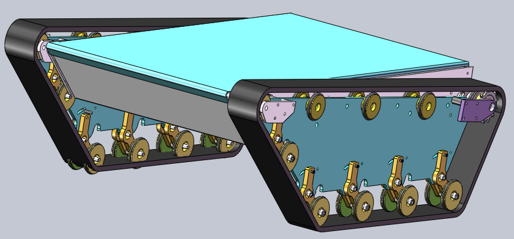

# solidworks mechanical 3D designs
design validation model for a Vertical Take-Off & Landing version of a trainer RC model

manufacturing file for tank chassis used for RC model size end-to-end driving project

